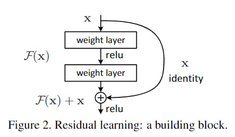

# Automated-Optical-Inspection
自動光學檢查（Automated Optical Inspection, AOI）是一種利用光學影像技術來自動檢查產品外觀或電路板製造品質的檢測方法。通過專門的軟體分析影像中的特徵，例如缺陷、短路、錯位或元件缺失等。這種技術廣泛應用於電子製造業，以確保產品符合質量標準，減少人為檢測的誤差，提高生產效率。
此程式使用AIdea的影像資料集，內容包括大量的瑕疵影像，使用基於Resnet神經網路進行分類。
# ResNet
ResNet（Residual Network）是一種深度神經網路架構。當網路變得很深時，學習效果可能反而會變差。為了解決這個問題，ResNet引入了殘差塊（Residual Block）的概念，讓網路學習層與層之間的殘差，而不是直接學習輸入到輸出的映射。這樣訊息可以直接跳過一些層，讓網路更容易學習到有效的特徵，避免因為層數過多而影響效果。
概念如下圖:

來源: https://arxiv.org/pdf/1512.03385.pdf
