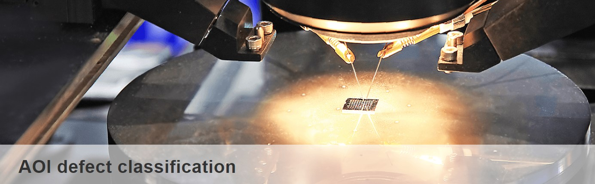

# Automated-Optical-Inspection

Automated Optical Inspection (AOI) is a method that uses optical imaging technology to automatically inspect the appearance of products or the manufacturing quality of circuit boards. Specialized software analyzes features in the images, such as defects, short circuits, misalignment, or missing components. This technology is widely used in the electronics manufacturing industry to ensure that products meet quality standards, reduce human inspection errors, and improve production efficiency.

source: [https://arxiv.org/pdf/1512.03385.pdf](https://aidea-web.tw/topic/285ef3be-44eb-43dd-85cc-f0388bf85ea4)

This program uses an image dataset from AIdea, which includes a large number of defect images. It classifies these images using a ResNet-based neural network.

# ResNet

ResNet ResNet (Residual Network) is a deep neural network architecture. When a network becomes very deep, its learning performance may actually worsen. To address this issue, ResNet introduces the concept of a Residual Block, allowing the network to learn the residuals between layers rather than directly mapping inputs to outputs. This enables information to bypass certain layers, making it easier for the network to learn effective features, thus avoiding the negative impact of having too many layers.

source: https://arxiv.org/pdf/1512.03385.pdf

# Results

After 20 training epochs, the accuracy reached 0.9700, the validation accuracy was 0.9919, and the test accuracy achieved 0.9839704.

# Final Ranking

Ranked 181st out of 619 participants.

